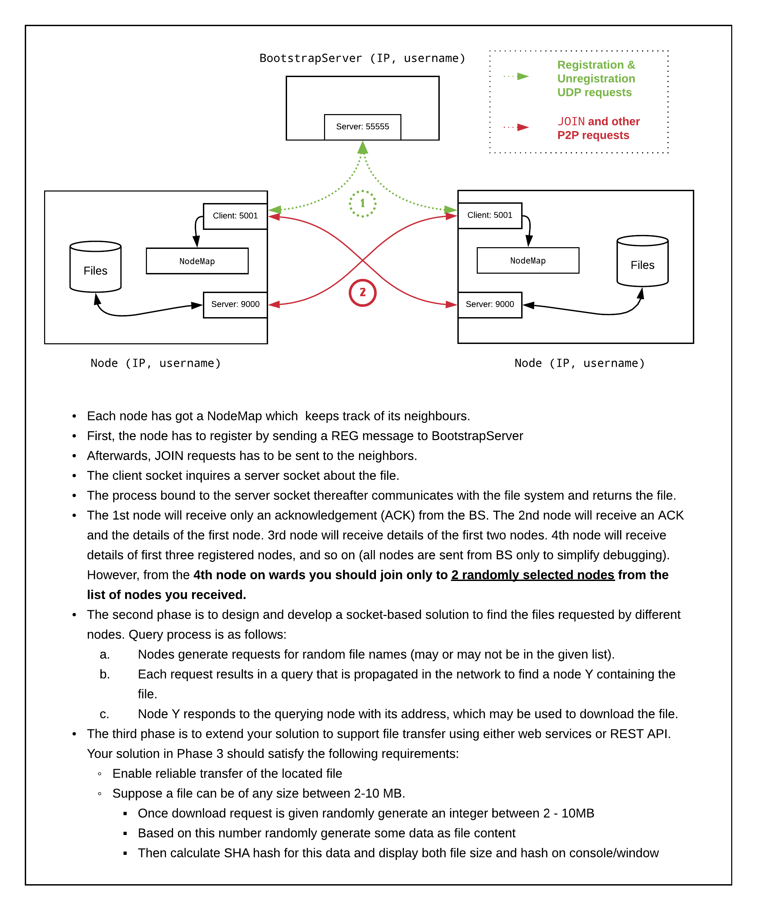
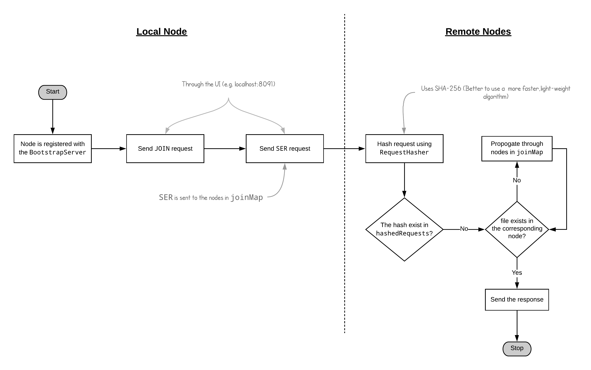
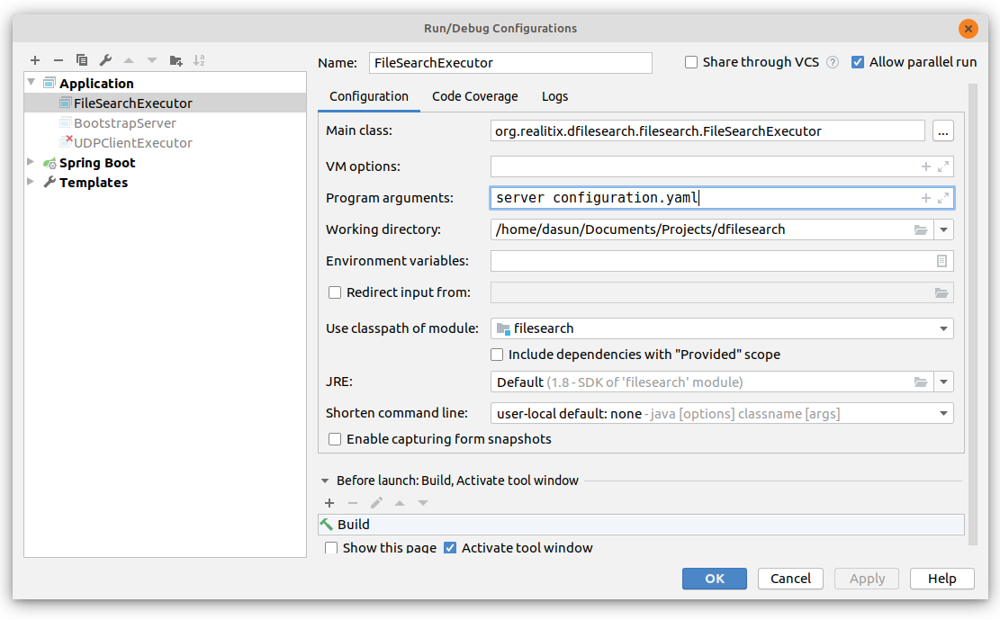
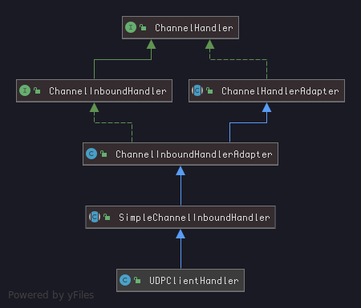

# Distributed P2P File Sharing System

A distributed methodology to search files in a system.

## Phases

* Phase 1: Design network topology &#9745;
* Phase 2: Design & Develop a socket-based solution to find files requested by different nodes. &#9744;
* Phase 3: Web service (REST API) to support file transfer. &#9745;

<div align="center"> 
    
</div>

## Theory behind P2P

There are three types of P2P architectures.

1. Structured P2P: Has a definite logical structure (e.g. ring, hypercube, etc.). The system provides an operation `LOOKUP(key)` which wil efficiently route the lookup request to the associated node (e.g. Chord System)
2. Unstructured P2P: Doesn't have a definite stuture, i.e. a random overlay (two nodes are linked with probability p).
3. Hybrid P2P: Some nodes in the cluster are appointed special functions in a well-organized fashion.

Since our system randomly assigns neighbors, it is an **Unstructured P2P**.

### Unstructured P2P

Each node maintains an ad hoc list of neighbors. The resulting overlay resembles a random graph: an edge `<u, v>` exists only with a certain probability `P[<u, v>]`.

* **Flooding**: issuing node u passes request for d to all neighbors. Request is ignored when receiving node had seen it before. Otherwise, v searches locally for d (recursively). May be limited by a **Time-To-Live**: a maximum number of hops.

    * Limited Flooding (maximal number of forwarding)
    * Probabilistic flooding (flood only with a certain probability)

* **Random walk**: issuing node u passes request for d to randomly chosen neighbor, v . If v does not have d, it forwards request to one of its randomly chosen neighbors, and so on.

## A bit about UDP

Clients and servers that communicate via a reliable channel (such as URL or socket) have a dedicated point-to-point channel between themselves (or at least the illusion of one). To communicate, they establish a connection, transmit the data, and then close down the connection. All data sent over the channel is received in the same order that it was sent. This is guaranteed by the channel.

In contrast, applications that communicate via datagrams send and receive completely independent packets of information. These clients and servers do not have and do not need a dedicated point-to-point channel. The delivery of datagrams to its destination is not guaranteed, nor is the order of arrival ([Source](http://journals.ecs.soton.ac.uk/java/tutorial/networking/datagrams/definition.html)).

<div align="center">
    
</div>


## Setting up in IntelliJ and running within Jetbrains environments

First, we need to set up the commandline arguments. 

1. Open `Run | Edit Configurations`, and tick `Allow Parallel Run` (for spawning a unique IDEA thread for each execution)
2. Add `server` and `configuration.yaml` as commandline arguments.

<div align="center">
    
</div>

3. Spin up a `BootstrapServer` instance first. Then, run `FileServer` changing the configuration in `configuration.yaml` **in the root directory** of the project (i.e. `/dfilesearch` directory). Try to spin more than 3 `FileServer` nodes up, and observe the BootstrapServer console and consoles of each node (pay attention to console outputs. The response messages are logged. Check for the log message below for an instance)  by registering multiple nodes.

```
13:10:22.546 [nioEventLoopGroup-2-1] INFO org.realitix.dfilesearch.filesearch.socket.UDPClientHandler - Response message: 0042 REGOK 2 127.0.0.1 5001 127.0.0.1 5002
```
 
The above message shows that the bootstrap server has sent the `REGOK` along with the IPs and ports of the currently registered nodes when a third node has requested `REG`.

Note that if two or more nodes have already been registered, the incoming nodes after that will be responded by nodes which are connected to the BS. **The passage in the assignment says that, we should connect only to two randomly selected nodes**. But take a look at this code extracted out from the `BootstrapServer` they've issued.

```java
class BootstrapServer {
    public static void main(String[] args){
      // ......
        if (isOkay) {
            if (nodes.size() == 1) {
                reply += "1 " + nodes.get(0).getIp() + " " + nodes.get(0).getPort();
            } else if (nodes.size() == 2) {
                reply += "2 " + nodes.get(0).getIp() + " " + nodes.get(0).getPort() + " " + nodes.get(1).getIp() + " " + nodes.get(1).getPort();
            } else {
                Random r = new Random();
                int Low = 0;
                int High = nodes.size();
                int random_1 = r.nextInt(High-Low) + Low;
                int random_2 = r.nextInt(High-Low) + Low;
                while (random_1 == random_2) {
                    random_2 = r.nextInt(High-Low) + Low;
                }
                echo (random_1 + " " + random_2);
                reply += "2 " + nodes.get(random_1).getIp() + " " + nodes.get(random_1).getPort() + " " + nodes.get(random_2).getIp() + " " + nodes.get(random_2).getPort();
            }
            nodes.add(new Neighbour(ip, port, username));
        }
    // .....
    }
}
```

The `BootstrapServer` already performs the randomization of the nodes and provide us with **two random nodes**. Therefore, regardless of how many nodes you register in the `BootstrapServer` for the `REG` query you get two nodes, who are supposed to be the neighbors of that particular node. 


Consider the log message given below.

```
INFO  [2019-12-25 03:10:59,490] org.realitix.dfilesearch.filesearch.socket.UDPClientHandler: Response message: 0042 REGOK 2 127.0.0.1 5003 127.0.0.1 5001
```

This is the nature of the overlay network. The details of the two nodes responded by the bootstrap server are the neighbors to the incoming node.

<div align="center">
    
</div>

**Note that you can log into a node's UI in its web server's port, as shown in the image above. From this, you can issue commands which eventually be delivered in UDP transports.**

## Running in independent nodes

1. Run `bootstrapserver-1.0-SNAPSHOT.jar` using `java -jar bootstrapserver-1.0-SNAPSHOT.jar`.
2. Provide the configurations to the `configuration.yaml`.
3. Build the project using `mvn clean install -DskipTests`. Note that I've included a plugin which copies an instance of `configuration.yaml` to `filesearch/target`.
3. Run the `.jar` file generated in `filesearch/target` using `java -jar filesearch-1.0-SNAPSHOT.jar server configuration.yaml`. To run multiple instances, simply change the ports (specially the HTTP port specified as `server`) in `configuration.yaml`.
4. Observe the BootstrapServer console and consoles of each node (pay attention to console outputs. The response messages are logged.

`configuration.yaml` file is shown below.

```yaml
name: Distributed File Executor
server:                     # HTTP server details
  applicationConnectors:
    - type: http
      port: 8091
  adminConnectors:
    - type: http
      port: 8092
ports:                     # client details
  port: 5001
  host: 127.0.0.1
  username: 1234abcd
bootstrapServer:           # bootstrap server details
  port: 55555
  host: 127.0.0.1
hops: 10
```

### Netstat commands

* Check for port 9000: `netstat -tulpn | grep 9000
`

* Send messages to UDP server: `echo -n "hello" | nc -4u localhost 9000`

### REST API

|     Endpoint    |                    Description                   |
|:---------------:|:------------------------------------------------:|
| `file/{fileName}` | Returns a randomly generated, hashed, file.      |
| `file/map`        | Returns the `nodemap`, which stores the neighbors. |
| `file/fileList`   | Returns the initiated file list.                 |


## Notes

1. After the initial handshakes and housekeeping, the client should connect to other peers (for file sharing). Thus, "host" and "port" should resemble those of that peers. This can be facilitated by giving some sort of a map. Think about it. Or, we should close the connection with the BS and initiate another connection with the peers after the initial handshakes.After the initial handshakes and housekeeping, the client should connect to other peers (for file sharing). Thus, "host" and "port" should resemble those of that peers. This can be facilitated by giving some sort of a map. Think about it. Or, we should close the connection with the BS and initiate another connection with the peers after the initial handshakes. This should be remedied in `UDPClient.java` file in its `run()` method. &#9745;

2. TCP mainains reliability, flow control, order, low speed. 
3. TCP is best suited for 
    
    * World Wide Web (HTTP, HTTPS)
    * Secure Shell (SSH)
    * File Transfer Protocol (FTP)
    * Email (SMTP, IMAP/POP)

4. UDP is best suited for:

    * VPN tunneling
    * Streaming videos
    * Online games
    * Live broadcasts
    * Domain Name System (DNS)
    * Voice over Internet Protocol (VoIP)
    * Trivial File Transfer Protocol (TFTP)

5. <u>Testing the project locally should be done giving the IP `127.0.0.1`.</u> We cannot test giving another IP in the configuration file, since the UDP sockets are bound for those particular ports.

6. Each `Node` has a `Channel` instance. Upon the `JOIN` query, these channels are initiated.

7. Web interface at `/`, and api at `/api`. File is served at `/api/file/{fileName}`, and nodemap is served at `/api/file/map`.

8. Testing `JOIN`: `0024 JOIN <IP> <PORT>`. Note the `<IP, PORT>` combination should be from a node joined later to the cluster.

9. `Netty` has the new abstraction of a `Channel`, and for UDP communication, `NioDatagramSocket` initialization does not maintain the notion of a `connection`. A `Channel` is like a vehicle which transmmits a message. For an example, `ctx.writeAndFlush()` method, called upon a `NioDatagramChannel` does not write to a `connection`, but just packs up a `DatagramPacket`, which specifies its own destination. Check `write()` method in `UDPClient`.


```java
public class UDPClient {
    // code
      public Channel createChannel(ChannelInitializer<DatagramChannel> channelInitializer) throws InterruptedException {
             Bootstrap b = new Bootstrap();
             b.group(new NioEventLoopGroup())
                     .channel(NioDatagramChannel.class)
                     .option(ChannelOption.SO_KEEPALIVE, true)
                     .localAddress(host, port)
                     .handler(channelInitializer);
             return b.bind(host, port).sync().channel();
         }

        /**
         * Write different messages
         * @param channel channel between the client and server
         * @param message transmitted message
         * @param remoteIp IP of bootstrap server
         * @param remotePort IP of bootstrap server
         * @throws InterruptedException
         */
       public ChannelFuture write(Channel channel, CommonMessage message, String remoteIp, int remotePort)
                throws InterruptedException {
           return channel.writeAndFlush(new DatagramPacket(Unpooled.copiedBuffer(message.toString(), CharsetUtil.UTF_8),
                   SocketUtils.socketAddress(remoteIp, remotePort))).sync().await();
        }

        /**
         * Runs the client socket
         * Registers the node with BS
         * Method connect() connects to a remote server and bind() binds the process to a local socket
         * @param bootstrapIp server host IP
         * @param bootstrapPort server port
         * host and port should be configured in the jar.
         */
        public ChannelFuture register(String bootstrapIp, int bootstrapPort) throws InterruptedException {
            Channel channel = createChannel(new UDPClientInitializer());
            ChannelFuture future = null;
            try {
                InetSocketAddress localAddress = (InetSocketAddress) channel.localAddress();
                future = write(channel, (new RegisterRequest(localAddress.getHostString(), localAddress.getPort(), username)), bootstrapIp, bootstrapPort);
            } catch (InterruptedException e) {
                logger.error(e.getMessage());
                Thread.currentThread().interrupt();         // Interrupt should not be ignored.
            }
            return future;
        }

}
```


## TODOs

Updated TODOs can be found in [this link](https://github.com/uom-cse-realitix/distributed-file-search/projects/1), in a Kanban board.

## FAQ

1. Why use a separate logger, such as `Log4j`?

    *  `System.out.println` buffers the input and synchronizes its contents. Furthermore, it switches between user level and kernel level to write to the console, therefore increasing the overhead. Therefore, an application-level logger is used in most industrial applications ([Source](https://javapapers.com/core-java/system-out-println/)).
    
2. Why a separate `webservice` module?

    * The question is divided into three phases. The third explicitly asks us to develop a web service. In this modular approach, the web service is a cohesive `.jar` which can be deployed in the same machine as the node. 
    
    * However, for simplicity, I have used `jetty` in `DropWizard` to spin up an HTTP server to instantiate the web service _inside_ `filesearch` module itself. This approach is **not modular** but simple. The resource class is given below.
    
     ```java
     @Path("/file")
        @Produces(MediaType.APPLICATION_JSON)
        public static class FileSharingResource {
    
            private final Logger logger = LogManager.getLogger(this.getClass());
    
            @GET
            @Path("{fileName}")
            public Response getFile(@PathParam("fileName") String fileName) {
                return Response.status(200).entity(synthesizeFile(fileName)).build();
            }
    
            private FileResponse synthesizeFile(String fileName){
                logger.info("Synthesizing the file");
                String randomString = fileName + RandomStringUtils.randomAlphabetic(20).toUpperCase();
                int size = (int) ((Math.random() * ((10 - 2) + 1)) + 2);    // change this to a more random algorithm
                FileResponse fileResponse = new FileResponse();
                fileResponse.setFileSize(size);
                fileResponse.setHash(DigestUtils.sha1Hex(randomString));
                logger.info("File synthesizing completed.");
                return fileResponse;
            }
        }
    ```
    
3. How does the `JOIN` has to happen?

    * After initial communication between the `BootstrapServer` (BS), the establishment of the network is done.
    
    * Afterwards, we have to communicate with the neighbours returned by the BS. 
    
4. Why a `configuration.yaml`? Can't we just hardcode the information?

    * Having a serializable `.yaml` is the standard way of coding a component.
    
    * Generally, each component (built as a `.jar`) is deployed alongwith this `.yaml`.
    
    * This way, we don't have to reach into the code-level (and we can have the freedom of not having the code repository cloned in each node's file system) to alter the information (since we fetch them from `.yaml`).
    
5. Why `Netty`?

    * Many organizations now use `Netty` to establish their networking infrastructure. `WSO2`, `ElasticSearch` (`Solr` successor), and plenty of others use it.
    
    * Its event-driven architecture mixed with interceptor pattern handlers gives cohesion to the code and much needed functionalities.
      <div align="center"> 
        
      </div>
      
        <div align="center"> 
          
        </div>
     
    


    
   
    

 

    
